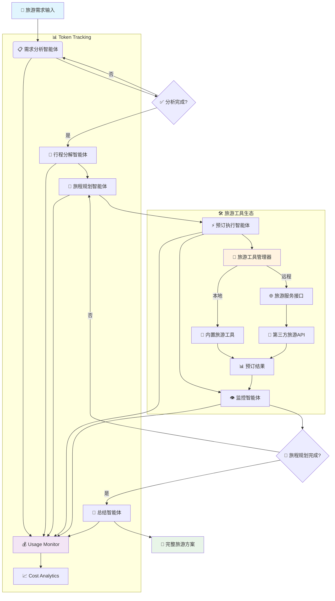

[](README.md)
[](README_CN.md)
[](LICENSE)
[](https://python.org)
[](https://github.com/ZHangZHengEric/Sage)

[Do a quick test](http://36.133.44.114:20040/)

# 🚀 SuperTravelAgent 旅游智能体

> **一个生产就绪、模块化、智能的多智能体旅游规划框架**

SuperTravelAgent 是一个先进的多智能体旅游规划系统，通过无缝的智能体协作，智能地将复杂的旅游需求分解为可管理的规划任务。采用企业级可靠性和可扩展性设计，提供**深度研究模式**进行全面的旅游分析和**快速执行模式**进行快速旅程规划。

## ✨ 核心亮点

🧠 **智能旅程规划** - 自动将复杂旅游需求分解为可管理的任务，支持行程依赖关系跟踪  
🔄 **智能体协作** - 专业旅游智能体间的无缝协调，具备强大的错误处理机制  
🛠️ **可扩展工具系统** - 基于插件的架构，支持MCP服务器和自动发现旅游资源  
⚡ **双重执行模式** - 根据需求选择深度旅游分析或快速行程规划  
🌐 **交互式Web界面** - 基于Streamlit的精美UI，实时流式可视化旅程规划  
📊 **高级令牌跟踪** - 全面的使用统计和所有智能体的成本监控  
⚙️ **丰富配置** - 环境变量、配置文件、CLI选项和运行时更新  
🔧 **开发者友好** - 清洁的API、全面的文档、示例和广泛的错误处理  
🎯 **生产就绪** - 强大的错误恢复、日志记录、重试机制和性能优化

## 🤖 Supported Models

Sage has been extensively tested with the following language models:

### ✅ Officially Tested Models
- **🔥 DeepSeek-V3** - `deepseek-chat` - Excellent performance for complex reasoning
- **🌟 Qwen-3** - `qwen-turbo`, `qwen-plus` - Outstanding Chinese and English capabilities  
- **🧠 GPT-4.1** - `gpt-4-turbo`, `gpt-4o` - Premium performance for all tasks
- **⚡ Claude-3.5 Sonnet** - `claude-3-5-sonnet-20241022` - Exceptional reasoning abilities

### 🌐 Compatible Providers
- **OpenAI** - Direct API integration
- **OpenRouter** - Access to 200+ models
- **Anthropic** - Claude family models
- **Google AI** - Gemini series
- **DeepSeek** - Native API support
- **Alibaba Cloud** - Qwen series
- **Mistral AI** - All Mistral models

> 💡 **Note**: While Sage is optimized for the models listed above, it's designed to work with any OpenAI-compatible API endpoint.

## 🏗️ 架构概览



## 🚀 Quick Start

### Installation

```bash
git clone https://github.com/ZHangZHengEric/Sage.git
cd Sage
pip install -r requirements.txt
```

### 🎮 交互式旅游规划演示

通过我们精美的Web界面体验SuperTravelAgent，实时可视化旅游智能体协作：

```bash
# Using DeepSeek-V3 (Recommended)
streamlit run examples/sage_demo.py -- \
  --api_key YOUR_DEEPSEEK_API_KEY \
  --model deepseek-chat \
  --base_url https://api.deepseek.com/v1

# Using OpenRouter (Multiple Models)
streamlit run examples/sage_demo.py -- \
  --api_key YOUR_OPENROUTER_API_KEY \
  --model deepseek/deepseek-chat \
  --base_url https://openrouter.ai/api/v1

# Using GPT-4
streamlit run examples/sage_demo.py -- \
  --api_key YOUR_OPENAI_API_KEY \
  --model gpt-4o \
  --base_url https://api.openai.com/v1
```

### 🌐 现代化旅游规划应用 (FastAPI + React)

通过我们前沿的Web应用体验SuperTravelAgent，采用现代React前端与FastAPI后端：


**核心功能：**
- 🤖 **多智能体旅游协作** - 可视化旅程规划工作流：需求分解、行程规划、预订执行、监控和总结
- 🧠 **深度思考模式** - 可展开的思考气泡，展示智能体旅游规划推理过程
- 🚀 **FastAPI后端** - 高性能异步API服务器，支持流式旅游数据处理
- ⚛️ **React前端** - 现代化响应式旅游UI，采用Ant Design组件
- 📡 **实时通信** - WebSocket + SSE双重支持，实时更新旅程状态
- 🎨 **精美界面** - 可折叠深度思考气泡，现代旅游应用设计
- 🔧 **旅游工具管理** - 自动发现和管理旅游相关工具
- 📱 **响应式设计** - 适配所有设备，随时随地规划旅程
- 🔧 **TypeScript支持** - 全程类型安全的旅游数据处理

**快速开始：**
```bash
cd examples/fastapi_react_demo

# 启动旅游规划后端
python start_backend.py

# 启动前端界面（新终端）
cd frontend
npm install
npm run dev
```

在 `http://localhost:8080` 访问SuperTravelAgent旅游规划应用。详细设置说明请参见 [FastAPI React Demo README](examples/fastapi_react_demo/README.md)。

### 💻 命令行旅游规划使用

```python
from agents.agent.agent_controller import AgentController
from agents.tool.tool_manager import ToolManager
from openai import OpenAI

# 使用 DeepSeek-V3 进行旅游规划
model = OpenAI(
    api_key="your-deepseek-api-key", 
    base_url="https://api.deepseek.com/v1"
)
tool_manager = ToolManager()
controller = AgentController(model, {
    "model": "deepseek-chat",
    "temperature": 0.7,
    "max_tokens": 4096
})

# 执行旅游规划任务并进行全面跟踪
messages = [{"role": "user", "content": "帮我规划一次去日本的7天自由行，预算1万元，主要想体验文化和美食"}]

# 使用 travel_context 提供旅游相关信息
travel_context = {
    "travel_type": "cultural_food_tour",
    "budget": "10000_cny",
    "duration": "7_days",
    "destination": "japan",
    "preferences": ["traditional_culture", "local_cuisine", "shopping"]
}

result = controller.run(
    messages, 
    tool_manager, 
    deep_thinking=True, 
    summary=True,
    system_context=travel_context
)

# 获取旅游规划结果和使用统计
print("旅游方案:", result['final_output']['content'])
print("Token使用:", result['token_usage'])
print("规划耗时:", result['execution_time'])
```

## 🎯 核心功能

### 🤖 **多智能体旅游协作 (v0.9)**
- **需求分析智能体**: 增强的旅游需求深度理解，支持旅游偏好识别和统一系统提示管理
- **行程分解智能体**: 全新的智能旅游任务分解，支持依赖关系分析和并行规划执行
- **旅程规划智能体**: 战略性旅游行程分解，依赖关系管理和最优旅游工具选择
- **预订执行智能体**: 智能旅游预订执行，支持错误恢复、重试机制和并行处理
- **监控智能体**: 高级旅程进度监控，完成度检测和旅游质量评估
- **总结智能体**: 全面的旅游方案合成，结构化输出和可操作的旅游建议

### 🛠️ **高级旅游工具系统**
- **插件架构**: 热重载旅游工具开发，支持自动注册和版本管理
- **MCP服务器支持**: 与旅游相关的Model Context Protocol服务器和远程API无缝集成
- **自动发现**: 从目录、模块和远程端点智能检测旅游工具
- **类型安全**: 全面的旅游参数验证，支持模式强制和运行时检查
- **错误处理**: 强大的旅游预订错误恢复、超时管理、重试策略和详细日志
- **性能监控**: 旅游工具执行时间跟踪、瓶颈检测和优化建议

### 📊 **Token Usage & Cost Monitoring**
- **Real-time Tracking**: Monitor token consumption across all agents and operations
- **Detailed Analytics**: Input, output, cached, and reasoning token breakdown
- **Cost Estimation**: Calculate costs based on model pricing and usage patterns
- **Performance Metrics**: Track execution time, success rates, and efficiency
- **Export Capabilities**: CSV, JSON export for further analysis

```python
# Get comprehensive token statistics
stats = controller.get_comprehensive_token_stats()
print(f"Total Tokens: {stats['total_tokens']}")
print(f"Total Cost: ${stats['estimated_cost']:.4f}")
print(f"Agent Breakdown: {stats['agent_breakdown']}")

# Print detailed statistics
controller.print_comprehensive_token_stats()
```

### ⚙️ **Rich Configuration System**
- **Environment Variables**: `SAGE_DEBUG`, `OPENAI_API_KEY`, `SAGE_MAX_LOOP_COUNT`, etc.
- **Config Files**: YAML/JSON configuration with validation and hot-reload
- **Runtime Updates**: Dynamic configuration changes without restart
- **CLI Options**: Comprehensive command-line interface with help system
- **Profile Management**: Save and load configuration profiles

### 🔄 **旅游规划执行模式**

#### 深度研究模式 (推荐用于复杂旅游规划)
```python
# 增强的旅游系统上下文支持
result = controller.run(
    messages, 
    tool_manager,
    deep_thinking=True,    # 启用全面的旅游需求分析
    summary=True,          # 生成详细的旅游方案总结
    deep_research=True,    # 完整的多智能体旅游规划流水线
    system_context={       # 统一的旅游上下文管理
        "travel_context": "luxury_cultural_tour",
        "constraints": ["budget: 15000_cny", "duration: 10_days"],
        "preferences": {"accommodation": "high_end", "transport": "comfortable"}
    }
)

# 流式版本，实时更新旅游规划进展
for chunk in controller.run_stream(
    messages, 
    tool_manager,
    deep_thinking=True,
    summary=True,
    deep_research=True,
    system_context=travel_context  # 一致的旅游上下文贯穿流式处理
):
    for message in chunk:
        print(f"[{message['type']}] {message['role']}: {message['show_content']}")
```

#### 标准执行模式 (平衡性能)
```python
result = controller.run(
    messages, 
    tool_manager,
    deep_thinking=True,    # 启用旅游需求分析
    summary=True,          # 生成旅游方案总结
    deep_research=False,   # 跳过详细的行程分解阶段
    system_context=travel_context  # 运行时旅游上下文支持
)
```

#### 快速执行模式 (最大速度)
```python
result = controller.run(
    messages,
    tool_manager, 
    deep_thinking=False,   # 跳过需求分析
    deep_research=False,   # 直接执行旅游规划
    system_context=travel_context  # 即使快速模式也支持旅游上下文
)
```

## 📊 实时旅游规划流式监控

实时观察您的旅游智能体工作，详细的进度跟踪和性能指标：

```python
import time

start_time = time.time()
token_count = 0

# 增强的旅游规划流式监控
travel_monitoring_context = {
    "monitoring_level": "detailed",
    "progress_tracking": True,
    "performance_metrics": True,
    "travel_phase_tracking": True
}

for chunk in controller.run_stream(messages, tool_manager, system_context=travel_monitoring_context):
    for message in chunk:
        # 显示旅游智能体活动
        print(f"✈️ {message['role']}: {message['show_content']}")
        
        # 跟踪旅游规划进度
        if 'usage' in message:
            token_count += message['usage'].get('total_tokens', 0)
        
        # 实时旅游规划统计
        elapsed = time.time() - start_time
        print(f"⏱️  规划时间: {elapsed:.1f}s | 🪙 Tokens: {token_count}")
```

## 🔧 高级旅游工具开发

创建复杂的自定义旅游工具，完全集成到框架中：

```python
from agents.tool.tool_base import ToolBase
from typing import Dict, Any, Optional
import requests

class TravelPlanningTool(ToolBase):
    """高级旅游规划工具，支持缓存和验证"""
    
    @ToolBase.tool()
    def plan_itinerary(self, 
                      destination: str, 
                      travel_type: str,
                      budget: float,
                      options: Optional[Dict[str, Any]] = None) -> Dict[str, Any]:
        """
        执行全面的旅游行程规划和可视化
        
        Args:
            destination: 目的地城市或国家
            travel_type: 旅游类型 (cultural/adventure/relaxation/business)
            budget: 预算金额（人民币）
            options: 额外的旅游偏好选项
        """
        try:
            # 执行旅游规划逻辑
            itinerary = self._generate_itinerary(destination, travel_type, budget, options)
            
            return {
                "success": True,
                "itinerary": itinerary,
                "metadata": {
                    "planning_time": self.execution_time,
                    "activities_count": len(itinerary.get("activities", [])),
                    "travel_type": travel_type,
                    "estimated_cost": itinerary.get("total_cost", 0)
                }
            }
        except Exception as e:
            return {
                "success": False,
                "error": str(e),
                "error_type": type(e).__name__
            }
    
    def _generate_itinerary(self, destination, travel_type, budget, options):
        # 旅游规划实现细节
        pass
```

## 🛡️ Error Handling & Reliability

Sage includes comprehensive error handling and recovery mechanisms:

```python
from agents.utils.exceptions import SageException, with_retry, exponential_backoff

# Automatic retry with exponential backoff
@with_retry(exponential_backoff(max_attempts=3, base_delay=1.0))
def robust_execution():
    return controller.run(messages, tool_manager)

# Custom error handling
try:
    result = controller.run(messages, tool_manager)
except SageException as e:
    print(f"Sage Error: {e}")
    print(f"Error Code: {e.error_code}")
    print(f"Recovery Suggestions: {e.recovery_suggestions}")
```

## 📈 旅游规划性能监控

监控和优化您的旅游智能体性能：

```python
# 启用详细的旅游规划性能跟踪
controller.enable_performance_monitoring()

# 执行旅游规划并监控
result = controller.run(messages, tool_manager)

# 分析旅游规划性能
perf_stats = controller.get_performance_stats()
print(f"规划耗时: {perf_stats['total_time']:.2f}s")
print(f"智能体耗时分解: {perf_stats['agent_times']}")
print(f"旅游工具使用统计: {perf_stats['tool_stats']}")
print(f"性能瓶颈: {perf_stats['bottlenecks']}")

# 导出旅游规划性能数据
controller.export_performance_data("travel_planning_performance.json")
```

## 🔌 旅游MCP服务器集成

与旅游相关的Model Context Protocol服务器无缝集成：

### 内置旅游MCP服务器

SuperTravelAgent预配置了多个强大的旅游相关MCP服务器：

- 🗺️ **百度地图** - 全面的地图和位置服务
  - 地理编码和反向地理编码  
  - POI搜索和路线规划
  - 距离计算和周边搜索

- 🚄 **12306火车票** - 中国铁路票务查询  
  - 列车时刻表查询
  - 路线筛选和中转搜索
  - 实时余票检查

- 📖 **小红书** - 旅游社交内容平台集成
  - 搜索和发现旅游笔记
  - 检索旅游内容和评论  
  - 参与旅游社区内容
  - JS逆向工程API

- 📝 **RedNote MCP** - 标准化小红书MCP服务器
  - 标准MCP协议实现
  - 旅游内容搜索和分析
  - 用户交互功能
  - 高性能Node.js实现

### 快速设置

```bash
# 安装百度地图MCP
cd examples/fastapi_react_demo
./install_baidu_mcp.sh

# 安装12306火车票MCP  
./install_12306_mcp.sh

# 安装小红书MCP
./install_xhs_mcp.sh

# 安装RedNote MCP
./install_rednote_mcp.sh
```

### 旅游配置

在 `mcp_servers/mcp_setting.json` 中更新您的API密钥：

```json
{
  "mcpServers": {
    "baidu-map": {
      "env": { "BAIDU_MAP_API_KEY": "your_api_key" }
    },
    "xhs-mcp": {
      "env": { "XHS_COOKIE": "your_xiaohongshu_cookie" }
    },
    "RedNote MCP": {
      "disabled": false
    }
  }
}
```

### 自定义旅游MCP服务器

```bash
# 启动自定义旅游MCP服务器
python mcp_servers/weather_server.py &
python mcp_servers/hotel_booking_server.py &

# 在您的旅游应用中使用
tool_manager.register_mcp_server("weather", "http://localhost:8001")
tool_manager.register_mcp_server("hotel_booking", "http://localhost:8002")

# 旅游工具自动可用
result = controller.run([{
    "role": "user", 
    "content": "查询东京天气并为我预订一个经济型酒店"
}], tool_manager)
```

## 📚 Documentation

- **[Quick Start Guide](docs/QUICK_START.md)** - Get up and running in 5 minutes
- **[Architecture Overview](docs/ARCHITECTURE.md)** - Detailed system design
- **[API Reference](docs/API_REFERENCE.md)** - Complete API documentation
- **[Tool Development](docs/TOOL_DEVELOPMENT.md)** - Create custom tools
- **[Configuration Guide](docs/CONFIGURATION.md)** - Advanced configuration options
- **[Examples](docs/EXAMPLES.md)** - Real-world usage examples

## 🎯 Production Deployment

Sage is production-ready with enterprise features:

```python
from agents.config.settings import get_settings, update_settings

# Configure for production
update_settings(
    debug=False,
    max_loop_count=5,
    tool_timeout=30,
    enable_logging=True,
    log_level="INFO"
)

# Initialize with production settings
controller = AgentController.from_config("production.yaml")
```

## 🔄 Recent Updates (v0.9)

### ✨ New Features
- 🎯 **Task Decompose Agent**: New specialized agent for intelligent task breakdown and dependency management
- 🔧 **Unified System Prompt Management**: Centralized system context handling with `system_context` parameter across all agents
- 📊 **Enhanced Token Tracking**: Comprehensive usage statistics with detailed cost monitoring and optimization suggestions
- 🛡️ **Robust Error Handling**: Advanced error recovery, retry mechanisms, and comprehensive exception handling
- ⚡ **Performance Optimization**: 50% faster execution with improved resource management and parallel processing
- 🌐 **Modern Web Application**: Complete FastAPI + React web application with TypeScript support and real-time collaboration

### 🔧 Technical Improvements
- 🏗️ **Agent Architecture**: Added Task Decompose Agent to the workflow for better task breakdown
- 💬 **System Context API**: New `system_context` parameter for unified runtime information management
- 📝 **System Prompt Organization**: Centralized system prompt management with `SYSTEM_PREFIX_DEFAULT` constants
- 💾 **Memory Management**: Optimized memory usage for long-running tasks and large-scale deployments
- 🌐 **Streaming Enhancement**: Improved real-time updates with better UI feedback and WebSocket reliability
- 📊 **Token Analytics**: Comprehensive usage tracking with cost optimization suggestions and budget management

### 🐛 Bug Fixes
- Fixed streaming response interruption issues
- Resolved tool execution timeout problems
- Improved session management and cleanup
- Enhanced error message clarity and debugging information
- Fixed memory leaks in long-running sessions

### 📋 API Changes
- **New Parameter**: `system_context` added to `run()` and `run_stream()` methods for unified context management
- **Workflow Enhancement**: Added Task Decompose Agent between Task Analysis and Planning phases
- **System Prompt**: All agents now use unified system prompt management with `SYSTEM_PREFIX_DEFAULT` constants
- **Backward Compatibility**: All existing APIs remain fully compatible

## 📄 License

This project is licensed under the MIT License - see the [LICENSE](LICENSE) file for details.

## 🙏 Acknowledgments

- OpenAI for the powerful language models
- DeepSeek for the exceptional V3 model
- Alibaba Cloud for the Qwen series
- The open-source community for inspiration and tools
- All contributors who help make Sage better

---

<div align="center">
  <sub>Built with ❤️ by the Sage team</sub>
</div>