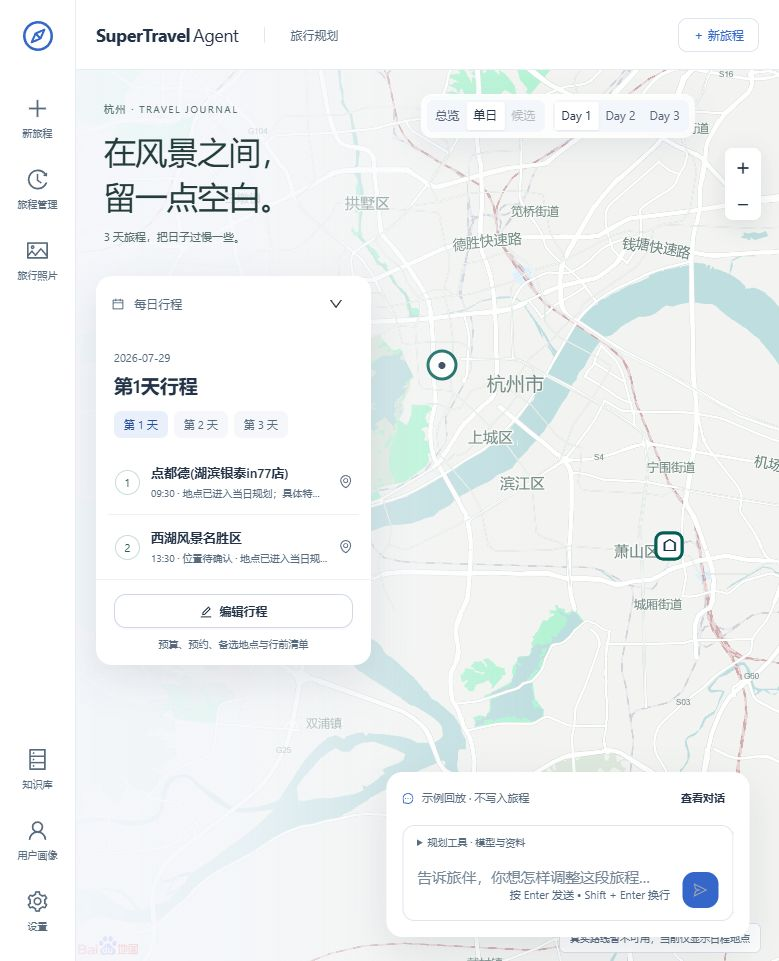

<h1 align="center">SuperTravelAgent</h1>

<p align="center">
  <a href="https://github.com/IT-coder-Yy/SuperTravel-Agent"></a>
  
  
  
  
  <a href="https://github.com/IT-coder-Yy/SuperTravel-Agent/actions/workflows/docs.yml"></a>
</p>

<p align="center">
  <strong>Plan a trip, explore the map, and refine every day.</strong><br>
  A multi-agent travel planner built with FastAPI, React and TypeScript.
</p>

<p align="center">
  <strong>English</strong> · <a href="README_CN.md">简体中文</a>
</p>

## Preview



The updated C1 Glacier White workspace, with a light Baidu map, a floating daily itinerary and an AI companion input. Trip management, photos, knowledge base, profile and settings remain accessible from the navigation rail. The screenshot shows the built-in Hangzhou case replay; its example data does not represent current prices or availability.

## A trip you can explore and edit

Start with a form or describe your trip in the conversation. The planner clarifies missing details and streams five stages: intent analysis, research, route planning, live verification and quality checks. A validated plan brings the conversation, daily itinerary and map into the same workspace.

Adjust activities, add notes, manage alternatives and check the revised schedule before applying a draft. The itinerary, map and exports follow the applied version; the previous formal version can be restored.

| Area | What you can do |
| --- | --- |
| Create a trip | Set cities, dates, budget, travelers and preferences; plan 1–7 days around one main destination. |
| Planning progress | Follow stage summaries and tool status through SSE; reconnect to an ongoing run or cancel it. |
| Itinerary and map | Browse days, inspect places and route legs, and move between activity cards and map locations. |
| Edit a plan | Change times and notes, add or replace places, move activities and manage candidates in a draft before applying it. |
| International trips | View destination and Beijing time, original-currency costs and dated CNY reference conversions. |
| Save and export | Restore local trip history; download the applied plan as Markdown or PDF. |
| Demo cases | Replay Hangzhou, Beijing and Chengdu cases without model or live planning-provider calls. |
| Mobile | Switch between conversation, itinerary and map, with simplified editing on small screens. |

External data carries availability and confirmation states. When a provider cannot verify a route, price or transport option, the interface explains the limitation or provides an official query entry. The app does not book trips, take payments or guarantee inventory.

## Quick start

Requires Python 3.10+, Node.js 20+ and npm. Local checks use the Conda `travel` environment; an equivalent Python environment also works.

```bash
git clone https://github.com/IT-coder-Yy/SuperTravel-Agent.git
cd SuperTravel-Agent

# Activate your Python virtual environment first.
python -m pip install -r requirements.txt -r examples/fastapi_react_demo/requirements.txt
cd examples/fastapi_react_demo/frontend
npm ci
cd ..
```

Copy `.env.example` to `.env` (`cp .env.example .env` on macOS/Linux, or `Copy-Item .env.example .env` in PowerShell). For live planning, fill in `SAGE_API_KEY`, `SAGE_MODEL_NAME` and `SAGE_BASE_URL` for your OpenAI-compatible model service. Built-in case replay does not need a model API key.

```bash
python start_backend.py
```

Open [localhost:8001](http://localhost:8001). The startup script builds the frontend when its output is missing or older than the source, then serves the app and API together.

For provider configuration, frontend development and troubleshooting, see the [web application guide](examples/fastapi_react_demo/README.md).

## Common workflows

Control names below are English translations of the current Chinese interface.

### Explore a demo

Click **New trip**, then choose **Replay** on a case. Pause, change playback speed or jump to the result. Browse the daily schedule and map, then choose **Use as a template** to prefill a new trip. Replay does not write to trip history.

### Create and refine your trip

Fill in the form and click **Create and plan**, or describe your requirements in the conversation. Once planning completes, edit activities in the itinerary. Changes remain in a draft until **Apply changes** validates and saves the new formal version. Resolve blocking issues before applying; use restore to return to the previous formal version.

### Download the plan

Export Markdown or PDF from the workspace. Exports contain the applied travel plan, without agent logs or source panels. Apply a pending draft before exporting its changes.

## Configuration

Keep secrets in `examples/fastapi_react_demo/.env`, which Git ignores. The [example environment file](examples/fastapi_react_demo/.env.example) lists provider options.

| Variable | Purpose |
| --- | --- |
| `SAGE_API_KEY`, `SAGE_MODEL_NAME`, `SAGE_BASE_URL` | Model credentials and OpenAI-compatible endpoint. |
| `SAGE_HOST`, `SAGE_PORT`, `SAGE_RELOAD` | Backend address, port and development reload. |
| `BAIDU_MAP_API_KEY`, `AMAP_MAPS_API_KEY` | Map, place and route providers. |
| `SERPER_API_KEY`, `TAVILY_API_KEY` | Web search and source retrieval. |
| `UNSPLASH_ACCESS_KEY` | Optional attributed travel imagery. |
| `SUPERTRAVEL_DB_PATH` | Optional path to the local SQLite trip database. |

Real planning depends on the providers you configure. MCP can extend the tool set; see [mcp_setting.example.json](mcp_servers/mcp_setting.example.json). Unavailable integrations are reported in the app.

## Development

```bash
# From the repository root, with your Python environment activated.
python -m pip install pytest
cd examples/fastapi_react_demo
python -m pytest backend/tests -q -p no:cacheprovider
cd frontend
npm run type-check
npm test
npm run build
```

For frontend development, run `npm run dev` alongside the backend and open [localhost:8080](http://localhost:8080). Use `E2E_BACKEND_URL` to change the Vite proxy target. Browser regressions use Playwright: with the backend running, install Chromium with `npx playwright install chromium` and run `npm run test:e2e -- e2e/demo-replay-formal-plan.spec.ts`.

| Directory | Contents |
| --- | --- |
| `agents/` | Agent orchestration, tool management and runtime utilities. |
| `examples/fastapi_react_demo/backend/` | FastAPI routes, planning services, schemas, persistence and exports. |
| `examples/fastapi_react_demo/frontend/` | React workspace, map, draft state and browser tests. |
| `examples/fastapi_react_demo/data/trip_demos/` | Sanitized, validated replay cases. |
| `mcp_servers/` | External tool integrations and configuration examples. |

The underlying agent framework builds on [Sage](https://github.com/ZHangZHengEric/Sage). Older framework guides remain in [docs/](docs/README.md); the current travel application is documented here and in its web application guide.
