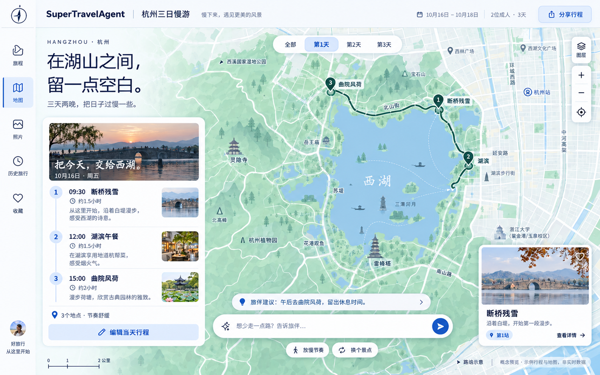

<h1 align="center">SuperTravelAgent</h1>

<p align="center">
  <a href="https://github.com/IT-coder-Yy/SuperTravel-Agent"></a>
  
  
  
  
  <a href="https://github.com/IT-coder-Yy/SuperTravel-Agent/actions/workflows/docs.yml"></a>
</p>

<p align="center">
  <strong>规划一趟旅行，在地图上查看路线，调整每一天。</strong><br>
  基于 FastAPI、React 和 TypeScript 的多 Agent 旅行规划应用。
</p>

<p align="center">
  <a href="README.md">English</a> · <strong>简体中文</strong>
</p>

## 预览



C1 冰川白概念预览：保留蓝绿西湖地图、浮动行程与 AI 旅伴输入区，在左上角加入「在湖山之间，留一点空白。」。本图为界面设计效果图，行程与地图信息均为示意，并非实际运行截图。

## 可查看、可调整的旅行方案

填写表单，或者在对话里描述旅行需求。系统澄清缺失条件后，以 SSE 展示需求分析、资料研究、路线规划、实时核验、质量校验五个阶段。通过校验的正式方案会同步进入对话、日程和地图工作台。

调整活动、添加备注、管理候选地点后，可以先检查修改后的日程，再应用草稿。行程、地图和下载内容跟随当前已应用版本，也可以恢复到上一正式版本。

| 功能 | 可以做什么 |
| --- | --- |
| 创建旅程 | 设置城市、日期、预算、人数和偏好，围绕一个主要目的地规划 1～7 天行程。 |
| 规划过程 | 查看阶段摘要和工具状态，断线后重新订阅正在运行的规划，或主动取消。 |
| 行程与地图 | 按天浏览活动，查看地点和路段，让活动卡片与地图位置联动。 |
| 修改方案 | 在草稿里调整时间、备注、地点、活动顺序和候选项，检查后再应用。 |
| 国际旅行 | 查看目的地与北京时间、原币费用和带日期的人民币参考换算。 |
| 保存与下载 | 恢复本地历史旅程，将已应用的正式方案导出为 Markdown 或 PDF。 |
| 案例回放 | 体验杭州、北京、成都案例，无需调用模型或实时规划服务。 |
| 移动端 | 在对话、行程和地图之间切换，小屏幕支持简化编辑。 |

外部信息会标注可用性和待确认状态。无法核验路线、价格或交通方案时，页面说明限制或提供官方查询入口。本应用不下单、不支付，也不保证库存。

## 快速开始

需要 Python 3.10+、Node.js 20+ 和 npm。本地检查使用 Conda 的 `travel` 环境，也可以使用具备相同依赖的 Python 虚拟环境。

```bash
git clone https://github.com/IT-coder-Yy/SuperTravel-Agent.git
cd SuperTravel-Agent

# 先激活 Python 虚拟环境。
python -m pip install -r requirements.txt -r examples/fastapi_react_demo/requirements.txt
cd examples/fastapi_react_demo/frontend
npm ci
cd ..
```

将 `.env.example` 复制为 `.env`：macOS/Linux 使用 `cp .env.example .env`，PowerShell 使用 `Copy-Item .env.example .env`。真实规划需要填写模型服务的 `SAGE_API_KEY`、`SAGE_MODEL_NAME` 和 `SAGE_BASE_URL`；内置案例回放不需要模型 API 密钥。

```bash
python start_backend.py
```

打开 [localhost:8001](http://localhost:8001)。启动脚本在前端产物缺失或源码更新时自动构建，由后端统一提供页面和 API。

外部服务配置、前端开发及排障说明见 [Web 应用指南](examples/fastapi_react_demo/README.md)。

## 常用流程

### 体验案例

点击 **新旅程**，在案例上选择 **一键回放**。可以暂停、调整倍速或跳到结果。在工作台查看每日活动和地图，然后点击 **以此为模板创建行程**，把案例条件带入新建表单。回放不会写入旅程历史。

### 创建并修改旅程

填写表单，点击 **创建并开始规划**，或者在对话中说明需求。规划完成后，在日程里编辑活动。修改先保存在草稿中，点击 **应用修改** 后才会校验并保存为新的正式版本。存在阻断问题时先修正；需要回退时可以恢复上一正式版本。

### 下载方案

使用工作台的下载入口导出 Markdown 或 PDF。文件包含已应用的旅行方案，不包含 Agent 日志或来源面板。要下载草稿中的修改，请先应用修改。

## 配置

密钥保存在 `examples/fastapi_react_demo/.env`，Git 会忽略该文件。完整变量见 [环境配置示例](examples/fastapi_react_demo/.env.example)。

| 环境变量 | 用途 |
| --- | --- |
| `SAGE_API_KEY`、`SAGE_MODEL_NAME`、`SAGE_BASE_URL` | 模型密钥、名称及 OpenAI 兼容服务地址。 |
| `SAGE_HOST`、`SAGE_PORT`、`SAGE_RELOAD` | 后端监听地址、端口和开发热重载。 |
| `BAIDU_MAP_API_KEY`、`AMAP_MAPS_API_KEY` | 地图、地点与路线服务。 |
| `SERPER_API_KEY`、`TAVILY_API_KEY` | 网页检索与来源提取。 |
| `UNSPLASH_ACCESS_KEY` | 可选的带署名旅行图片。 |
| `SUPERTRAVEL_DB_PATH` | 可选的本地 SQLite 旅程数据库路径。 |

真实规划能力取决于已配置的外部服务。可通过 MCP 扩展工具，配置结构见 [mcp_setting.example.json](mcp_servers/mcp_setting.example.json)。无法使用的集成会在页面中说明。

## 开发

```bash
# 从仓库根目录开始，先激活 Python 环境。
python -m pip install pytest
cd examples/fastapi_react_demo
python -m pytest backend/tests -q -p no:cacheprovider
cd frontend
npm run type-check
npm test
npm run build
```

前端开发时保持后端运行，另开终端执行 `npm run dev`，访问 [localhost:8080](http://localhost:8080)。Vite 的代理目标可通过 `E2E_BACKEND_URL` 修改。浏览器回归使用 Playwright：后端启动后，执行 `npx playwright install chromium`，再运行 `npm run test:e2e -- e2e/demo-replay-formal-plan.spec.ts`。

| 目录 | 内容 |
| --- | --- |
| `agents/` | Agent 调度、工具管理和运行时工具。 |
| `examples/fastapi_react_demo/backend/` | FastAPI 路由、规划服务、Schema、持久化及导出。 |
| `examples/fastapi_react_demo/frontend/` | React 工作台、地图、草稿状态与浏览器测试。 |
| `examples/fastapi_react_demo/data/trip_demos/` | 脱敏并通过校验的案例回放包。 |
| `mcp_servers/` | 外部工具集成及配置示例。 |

底层 Agent 框架基于 [Sage](https://github.com/ZHangZHengEric/Sage)。早期框架文档保留在 [docs/](docs/README.md)；当前旅行产品以本页和 Web 应用指南为准。
