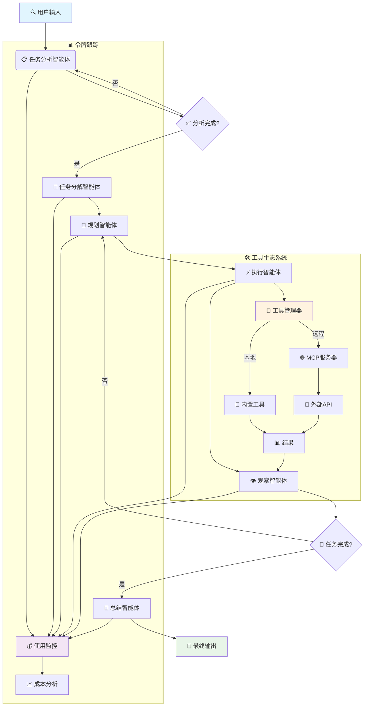
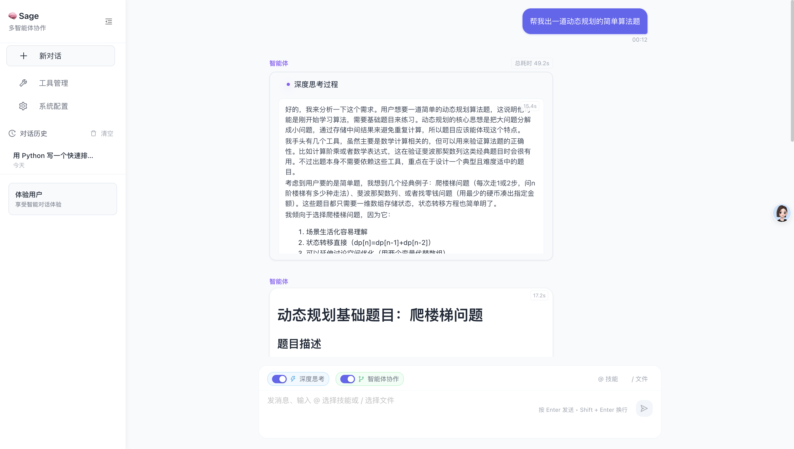

[](README.md)
[](README_CN.md)
[](LICENSE)
[](https://python.org)
[](https://github.com/ZHangZHengEric/Sage)

[试一下](http://36.133.44.114:20040/)

# 🚀 SuperTravelAgent 旅游智能体

> **生产就绪、模块化、智能的多智能体旅游规划框架**

SuperTravelAgent 是一个先进的多智能体旅游规划系统，通过无缝的智能体协作，智能地将复杂的旅游需求分解为可管理的规划任务。采用企业级可靠性和可扩展性设计，提供**深度研究模式**进行全面的旅游分析和**快速执行模式**进行快速旅程规划。

## ✨ 核心亮点

🧠 **智能旅程规划** - 自动将复杂旅游需求分解为可管理的任务，支持行程依赖关系跟踪  
🔄 **智能体协作** - 专业旅游智能体间的无缝协调，具备强大的错误处理机制  
🛠️ **可扩展工具系统** - 基于插件的架构，支持MCP服务器和自动发现旅游资源  
⚡ **双重执行模式** - 根据需求选择深度旅游分析或快速行程规划  
🌐 **交互式Web界面** - 基于Streamlit的精美UI，实时流式可视化旅程规划  
📊 **高级令牌跟踪** - 全面的使用统计和所有智能体的成本监控  
⚙️ **丰富配置** - 环境变量、配置文件、CLI选项和运行时更新  
🔧 **开发者友好** - 清洁的API、全面的文档、示例和广泛的错误处理  
🎯 **生产就绪** - 强大的错误恢复、日志记录、重试机制和性能优化

## 🤖 支持的模型

Sage 已经过以下语言模型的广泛测试：

### ✅ 官方测试模型
- **🔥 DeepSeek-V3** - `deepseek-chat` - 复杂推理的卓越性能
- **🌟 Qwen-3** - `qwen-turbo`, `qwen-plus` - 出色的中英文能力  
- **🧠 GPT-4.1** - `gpt-4-turbo`, `gpt-4o` - 所有任务的顶级性能
- **⚡ Claude-3.5 Sonnet** - `claude-3-5-sonnet-20241022` - 卓越的推理能力

### 🌐 兼容提供商
- **OpenAI** - 直接API集成
- **OpenRouter** - 访问200+模型
- **Anthropic** - Claude系列模型
- **Google AI** - Gemini系列
- **DeepSeek** - 原生API支持
- **阿里云** - Qwen系列
- **Mistral AI** - 所有Mistral模型

> 💡 **注意**: 虽然Sage针对上述模型进行了优化，但它设计为可与任何OpenAI兼容的API端点配合使用。

## 🏗️ 架构概览



## 🚀 快速开始

### 安装

```bash
git clone https://github.com/ZHangZHengEric/Sage.git
cd Sage
pip install -r requirements.txt
```

### 🎮 交互式旅游规划演示

通过我们精美的Web界面体验SuperTravelAgent，实时旅游智能体可视化：

```bash
# 使用 DeepSeek-V3 (推荐)
streamlit run examples/sage_demo.py -- \
  --api_key YOUR_DEEPSEEK_API_KEY \
  --model deepseek-chat \
  --base_url https://api.deepseek.com/v1

# 使用 OpenRouter (多模型)
streamlit run examples/sage_demo.py -- \
  --api_key YOUR_OPENROUTER_API_KEY \
  --model deepseek/deepseek-chat \
  --base_url https://openrouter.ai/api/v1

# 使用 GPT-4
streamlit run examples/sage_demo.py -- \
  --api_key YOUR_OPENAI_API_KEY \
  --model gpt-4o \
  --base_url https://api.openai.com/v1
```

### 🌐 现代化旅游规划应用（FastAPI + React）

通过我们前沿的Web应用体验SuperTravelAgent，采用现代React前端和FastAPI后端：



**功能特性：**
- 🤖 **多智能体旅游协作** - 可视化旅程规划工作流，包含需求分解、行程规划、预订执行、监控和总结
- 🧠 **深度思考模式** - 可展开的思考气泡，显示旅游智能体推理过程
- 🚀 **FastAPI后端** - 高性能异步API服务器，支持流式旅游数据处理
- ⚛️ **React前端** - 现代化响应式旅游UI，采用Ant Design组件
- 📡 **实时通信** - WebSocket + SSE双重支持，实时更新旅程状态
- 🎨 **精美界面** - 可折叠深度思考气泡，现代旅游应用设计
- 🔧 **旅游工具管理** - 自动发现和管理旅游相关工具
- 📱 **响应式设计** - 适配所有设备，随时随地规划旅程
- 🔧 **TypeScript支持** - 全程类型安全的旅游数据处理

**快速开始：**
```bash
cd examples/fastapi_react_demo

# 启动旅游规划后端
python start_backend.py

# 启动前端界面（新终端）
cd frontend
npm install
npm run dev
```

在 `http://localhost:8080` 访问SuperTravelAgent旅游规划应用。详细设置说明请参见 [FastAPI React Demo README](examples/fastapi_react_demo/README.md)。

### 💻 命令行旅游规划使用

```python
from agents.agent.agent_controller import AgentController
from agents.tool.tool_manager import ToolManager
from openai import OpenAI

# 使用 DeepSeek-V3 进行旅游规划
model = OpenAI(
    api_key="your-deepseek-api-key", 
    base_url="https://api.deepseek.com/v1"
)
tool_manager = ToolManager()
controller = AgentController(model, {
    "model": "deepseek-chat",
    "temperature": 0.7,
    "max_tokens": 4096
})

# 执行旅游规划任务并进行全面跟踪
messages = [{"role": "user", "content": "帮我规划一次去日本的7天自由行，预算1万元，主要想体验文化和美食"}]

# 使用 travel_context 提供旅游相关信息
travel_context = {
    "旅游类型": "文化美食之旅",
    "预算": "10000元人民币",
    "时长": "7天",
    "目的地": "日本",
    "偏好": ["传统文化", "当地美食", "购物"]
}

result = controller.run(
    messages, 
    tool_manager, 
    deep_thinking=True, 
    summary=True,
    system_context=travel_context
)

# 获取旅游规划结果和使用统计
print("旅游方案:", result['final_output']['content'])
print("Token使用:", result['token_usage'])
print("规划耗时:", result['execution_time'])
```

## 🎯 核心功能

### 🤖 **多智能体协作 (v0.9)**
- **任务分析智能体**: 增强的深度理解，支持上下文感知和统一系统提示管理
- **任务分解智能体**: 新增智能任务分解，支持依赖分析和并行执行规划
- **规划智能体**: 战略性分解，支持依赖管理和最优工具选择
- **执行智能体**: 智能工具执行，支持错误恢复、重试机制和并行处理
- **观察智能体**: 高级进度监控，支持完成检测和质量评估
- **总结智能体**: 全面结果综合，支持结构化输出和可操作见解

### 🛠️ **高级工具系统**
- **插件架构**: 热重载工具开发，支持自动注册和版本管理
- **MCP 服务器支持**: 与模型上下文协议服务器和远程API无缝集成
- **自动发现**: 从目录、模块和远程端点智能检测工具
- **类型安全**: 全面的参数验证和模式强制以及运行时检查
- **错误处理**: 强大的错误恢复、超时管理、重试策略和详细日志
- **性能监控**: 工具执行时间跟踪、瓶颈检测和优化建议

### 📊 **Token使用和成本监控**
- **实时跟踪**: 监控所有智能体和操作的token消耗
- **详细分析**: 输入、输出、缓存和推理token细分
- **成本估算**: 基于模型定价和使用模式计算成本
- **性能指标**: 跟踪执行时间、成功率和效率
- **导出功能**: CSV、JSON 导出供进一步分析

```python
# 获取全面的token统计
stats = controller.get_comprehensive_token_stats()
print(f"总Token数: {stats['total_tokens']}")
print(f"总成本: ${stats['estimated_cost']:.4f}")
print(f"智能体细分: {stats['agent_breakdown']}")

# 打印详细统计
controller.print_comprehensive_token_stats()
```

### ⚙️ **丰富的配置系统**
- **环境变量**: `SAGE_DEBUG`, `OPENAI_API_KEY`, `SAGE_MAX_LOOP_COUNT` 等
- **配置文件**: YAML/JSON 配置，支持验证和热重载
- **运行时更新**: 无需重启的动态配置更改
- **命令行选项**: 全面的命令行界面和帮助系统
- **配置文件管理**: 保存和加载配置配置文件

### 🔄 **执行模式**

#### 深度研究模式（复杂任务推荐）
```python
# 增强的system_context支持
result = controller.run(
    messages, 
    tool_manager,
    deep_thinking=True,    # 启用全面任务分析
    summary=True,          # 生成详细总结和见解
    deep_research=True,    # 完整多智能体流水线与分解
    system_context={       # 统一系统上下文管理
        "项目背景": "AI研究项目",
        "约束条件": ["时间: 2小时", "资源: 有限"],
        "偏好设置": {"输出格式": "详细报告"}
    }
)

# 实时更新的流式版本
for chunk in controller.run_stream(
    messages, 
    tool_manager,
    deep_thinking=True,
    summary=True,
    deep_research=True,
    system_context=system_context  # 流式传输中一致的系统上下文
):
    for message in chunk:
        print(f"[{message['type']}] {message['role']}: {message['show_content']}")
```

#### 标准执行模式（平衡性能）
```python
result = controller.run(
    messages, 
    tool_manager,
    deep_thinking=True,    # 启用任务分析
    summary=True,          # 生成总结
    deep_research=False,   # 跳过详细分解阶段
    system_context=system_context  # 运行时上下文支持
)
```

#### 快速执行模式（最大速度）
```python
result = controller.run(
    messages,
    tool_manager, 
    deep_thinking=False,   # 跳过分析
    deep_research=False,   # 直接执行
    system_context=system_context  # 即使快速模式也支持上下文
)
```

## 📊 实时流式传输和监控

实时观看智能体工作，详细进度跟踪和性能指标：

```python
import time

start_time = time.time()
token_count = 0

# 增强的系统上下文流式传输
system_context = {
    "监控级别": "详细",
    "进度跟踪": True,
    "性能指标": True
}

for chunk in controller.run_stream(messages, tool_manager, system_context=system_context):
    for message in chunk:
        # 显示智能体活动
        print(f"🤖 {message['role']}: {message['show_content']}")
        
        # 跟踪进度
        if 'usage' in message:
            token_count += message['usage'].get('total_tokens', 0)
        
        # 实时统计
        elapsed = time.time() - start_time
        print(f"⏱️  时间: {elapsed:.1f}s | 🪙 令牌: {token_count}")
```

## 🔧 高级工具开发

创建具有完整框架集成的复杂自定义工具：

```python
from agents.tool.tool_base import ToolBase
from typing import Dict, Any, Optional
import requests

class DataAnalysisTool(ToolBase):
    """高级数据分析工具，支持缓存和验证"""
    
    @ToolBase.tool()
    def analyze_data(self, 
                    data_source: str, 
                    analysis_type: str,
                    options: Optional[Dict[str, Any]] = None) -> Dict[str, Any]:
        """
        执行全面的数据分析和可视化
        
        Args:
            data_source: 数据源URL或路径
            analysis_type: 分析类型（statistical/trend/correlation）
            options: 额外的分析选项
        """
        try:
            # 您的实现代码
            result = self._perform_analysis(data_source, analysis_type, options)
            
            return {
                "success": True,
                "data": result,
                "metadata": {
                    "execution_time": self.execution_time,
                    "data_size": len(result.get("records", [])),
                    "analysis_type": analysis_type
                }
            }
        except Exception as e:
            return {
                "success": False,
                "error": str(e),
                "error_type": type(e).__name__
            }
    
    def _perform_analysis(self, source, analysis_type, options):
        # 实现细节
        pass
```

## 🛡️ 错误处理和可靠性

Sage 包含全面的错误处理和恢复机制：

```python
from agents.utils.exceptions import SageException, with_retry, exponential_backoff

# 带指数退避的自动重试
@with_retry(exponential_backoff(max_attempts=3, base_delay=1.0))
def robust_execution():
    return controller.run(messages, tool_manager)

# 自定义错误处理
try:
    result = controller.run(messages, tool_manager)
except SageException as e:
    print(f"Sage 错误: {e}")
    print(f"错误代码: {e.error_code}")
    print(f"恢复建议: {e.recovery_suggestions}")
```

## 📈 性能监控

监控和优化您的智能体性能：

```python
# 启用详细的性能跟踪
controller.enable_performance_monitoring()

# 带监控的执行
result = controller.run(messages, tool_manager)

# 分析性能
perf_stats = controller.get_performance_stats()
print(f"执行时间: {perf_stats['total_time']:.2f}s")
print(f"智能体分解: {perf_stats['agent_times']}")
print(f"工具使用: {perf_stats['tool_stats']}")
print(f"瓶颈: {perf_stats['bottlenecks']}")

# 导出性能数据
controller.export_performance_data("performance_report.json")
```

## 🔌 MCP 服务器集成

与模型上下文协议服务器无缝集成：

```bash
# 启动 MCP 服务器
python mcp_servers/weather_server.py &
python mcp_servers/database_server.py &

# 在您的应用中使用
tool_manager.register_mcp_server("weather", "http://localhost:8001")
tool_manager.register_mcp_server("database", "http://localhost:8002")

# 工具自动可用
result = controller.run([{
    "role": "user", 
    "content": "获取东京的天气并保存到数据库"
}], tool_manager)
```

## 📚 文档

- **[快速开始指南](docs/QUICK_START.md)** - 5分钟内快速上手
- **[架构概览](docs/ARCHITECTURE.md)** - 详细的系统设计
- **[API 参考](docs/API_REFERENCE_CN.md)** - 完整的 API 文档
- **[工具开发](docs/TOOL_DEVELOPMENT.md)** - 创建自定义工具
- **[配置指南](docs/CONFIGURATION.md)** - 高级配置选项
- **[示例](docs/EXAMPLES_CN.md)** - 实际使用示例

## 🎯 生产部署

Sage 具备企业级特性，已为生产环境做好准备：

```python
from agents.config.settings import get_settings, update_settings

# 生产环境配置
update_settings(
    debug=False,
    max_loop_count=5,
    tool_timeout=30,
    enable_logging=True,
    log_level="INFO"
)

# 使用生产设置初始化
controller = AgentController.from_config("production.yaml")
```

## 🔄 最新更新 (v0.9)

### ✨ 新功能
- 🎯 **任务分解智能体**: 新增专门用于智能任务分解和依赖管理的智能体
- 🔧 **统一系统提示管理**: 通过`system_context`参数在所有智能体间集中式系统上下文处理
- 📊 **增强令牌跟踪**: 全面使用统计，详细成本监控和优化建议
- 🛡️ **强大错误处理**: 高级错误恢复、重试机制和全面异常处理
- ⚡ **性能优化**: 通过改进的资源管理和并行处理实现50%更快的执行速度
- 🌐 **现代化Web应用**: 完整的FastAPI + React Web应用，支持TypeScript和实时协作

### 🔧 技术改进
- 🏗️ **智能体架构**: 在工作流中添加任务分解智能体以改善任务分解
- 💬 **系统上下文API**: 新增`system_context`参数用于统一运行时信息管理
- 📝 **系统提示组织**: 通过`SYSTEM_PREFIX_DEFAULT`常量实现集中式系统提示管理
- 💾 **内存管理**: 为长时间运行任务和大规模部署优化内存使用
- 🌐 **流式传输增强**: 改进实时更新，更好的UI反馈和WebSocket可靠性
- 📊 **令牌分析**: 全面使用跟踪，成本优化建议和预算管理

### 🐛 错误修复
- 修复流式响应中断问题
- 解决工具执行超时问题
- 改进会话管理和清理
- 增强错误消息清晰度和调试信息
- 修复长时间运行会话中的内存泄漏

### 📋 API变更
- **新参数**: 在`run()`和`run_stream()`方法中添加`system_context`用于统一上下文管理
- **工作流增强**: 在任务分析和规划阶段之间添加任务分解智能体
- **系统提示**: 所有智能体现在使用`SYSTEM_PREFIX_DEFAULT`常量进行统一系统提示管理
- **向后兼容**: 所有现有API保持完全兼容

## 📄 许可证

本项目采用 MIT 许可证 - 详见 [LICENSE](LICENSE) 文件。

## 🙏 致谢

- OpenAI 提供的强大语言模型
- DeepSeek 提供的卓越V3模型
- 阿里云提供的通义千问系列
- 开源社区提供的灵感和工具
- 所有帮助 Sage 变得更好的贡献者

---

<div align="center">
  <sub>由 Sage 团队用 ❤️ 构建</sub>
</div>
