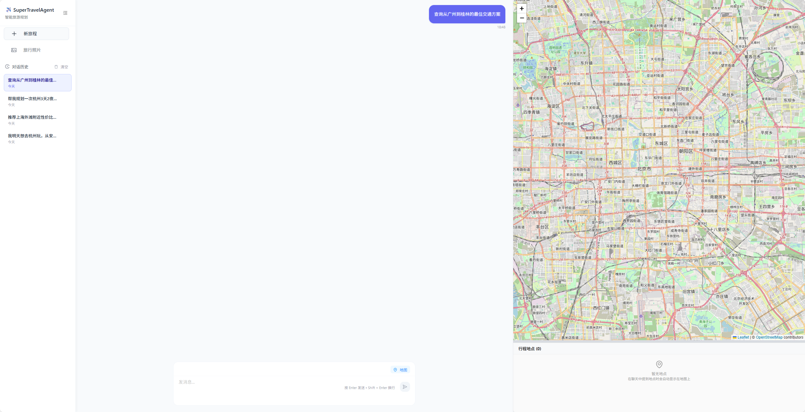

# PowerPaint 图像编辑功能集成指南

## 🎨 概述

已成功为您的 Sage 多智能体协作框架集成了 PowerPaint 图像编辑功能。PowerPaint 是一个强大的 AI 图像编辑工具，支持：

- ✅ **文本引导物体修补** - 根据文本描述在指定区域生成内容
- ✅ **智能物体移除** - 自动移除选中物体并智能填补背景
- ✅ **图像扩展** - 智能扩展图像边界
- ✅ **形状引导修补** - 根据蒙版形状和文本生成相应内容

## 📁 文件结构

```
/home/user_3/Advanced_AI_Course/
├── Sage/
│   └── examples/fastapi_react_demo/
│       ├── frontend/src/components/
│       │   └── PhotoEditor.tsx                  # 前端图像编辑组件
│       ├── backend/
│       │   ├── powerpaint_service.py           # PowerPaint 服务模块
│       │   ├── powerpaint_real.py              # 真实 PowerPaint 集成（安装后生成）
│       │   └── main.py                         # 后端 API（已添加 PowerPaint 端点）
│       ├── install_powerpaint.sh               # PowerPaint 安装脚本
│       └── start_with_powerpaint.sh            # 便捷启动脚本
├── powerpaint_models/                          # PowerPaint 模型和配置
│   ├── config.yaml                             # PowerPaint 配置文件
│   └── cache/                                  # 模型缓存目录
├── PowerPaint/                                 # PowerPaint 源码
└── POWERPAINT_README.md                        # 详细使用说明

```

## 🚀 快速开始

### 1. 安装 PowerPaint

```bash
# 进入项目目录
cd /home/user_3/Advanced_AI_Course/Sage/examples/fastapi_react_demo

# 给脚本添加执行权限
chmod +x install_powerpaint.sh
chmod +x start_with_powerpaint.sh

# 运行安装脚本（这将创建 conda 环境并安装依赖）
./install_powerpaint.sh
```

### 2. 启动服务

**方法一：使用便捷启动脚本**
```bash
# 启动后端服务（自动激活 conda 环境）
./start_with_powerpaint.sh
```

**方法二：手动启动**
```bash
# 激活 conda 环境
conda activate ppt

# 启动后端
cd /home/user_3/Advanced_AI_Course/Sage/examples/fastapi_react_demo/backend
python start_backend.py

# 在新终端启动前端
cd /home/user_3/Advanced_AI_Course/Sage/examples/fastapi_react_demo/frontend
npm run dev
```

### 3. 访问界面

1. 打开浏览器访问：http://localhost:8080
2. 在左侧导航栏点击 "📷 照片编辑" 菜单
3. 开始使用 PowerPaint 功能！

## 🎯 使用方法

### 文本引导物体修补
1. 上传图片
2. 选择 "文本引导修补" 标签
3. 在图片上绘制蒙版区域（标记要修改的部分）
4. 输入描述文本（如："一只可爱的小猫"）
5. 调整引导强度参数
6. 点击 "开始编辑"

### 物体移除
1. 上传图片
2. 选择 "物体移除" 标签
3. 在图片上绘制蒙版（标记要移除的物体）
4. 点击 "开始编辑"（无需输入文本）

### 图像扩展
1. 上传图片
2. 选择 "图像扩展" 标签
3. 调整水平和垂直扩展比例
4. 点击 "开始编辑"（无需绘制蒙版）

### 形状引导修补
1. 上传图片
2. 选择 "形状引导修补" 标签
3. 绘制想要的形状蒙版
4. 输入描述文本
5. 调整形状拟合度（0.5-0.6 宽松，0.8-0.95 严格）
6. 点击 "开始编辑"

## ⚙️ 技术实现

### 前端组件 (PhotoEditor.tsx)
- 使用 React + TypeScript 构建
- Ant Design 组件库提供 UI
- Canvas API 实现蒙版绘制
- 支持图像上传、预览和下载

### 后端服务 (powerpaint_service.py)
- FastAPI 端点：`/api/powerpaint/edit`
- 支持 base64 图像处理
- 模拟实现（演示用）+ 真实 PowerPaint 集成
- 错误处理和日志记录

### 集成特性
- **模块化设计**：易于扩展和维护
- **环境隔离**：使用 conda 环境避免依赖冲突
- **向后兼容**：不影响现有 Sage 功能
- **用户友好**：提供完整的安装和使用指南

## 🔧 配置说明

### conda 环境
- 环境名称：`ppt`
- Python 版本：3.9
- 主要依赖：torch, diffusers, transformers, Pillow

### 模型配置
配置文件位置：`/home/user_3/Advanced_AI_Course/powerpaint_models/config.yaml`

可配置项：
- 设备选择（auto/cpu/cuda）
- 模型版本（v1/v2）
- 默认参数
- 缓存目录

## 📝 注意事项

1. **首次使用**：需要下载大量模型文件，请确保网络稳定
2. **硬件要求**：建议使用 GPU 加速，至少 8GB 显存
3. **环境管理**：每次使用前需激活 conda 环境
4. **存储空间**：模型文件可能占用几 GB 空间

## 🐛 故障排除

### 常见问题

**1. conda 环境激活失败**
```bash
# 重新初始化 conda
conda init
source ~/.bashrc
```

**2. 模型下载失败**
- 检查网络连接
- 可能需要科学上网
- 尝试手动下载模型

**3. 内存不足**
```bash
# 使用 CPU 模式
export CUDA_VISIBLE_DEVICES=""
```

**4. 前端访问失败**
- 确认后端服务正在运行
- 检查端口 8000 和 8080 是否被占用

## 🆘 获取帮助

如有问题，请查看：
1. `/home/user_3/Advanced_AI_Course/POWERPAINT_README.md` - 详细说明
2. 后端日志：检查终端输出
3. PowerPaint 官方文档：https://github.com/open-mmlab/PowerPaint

---

🎉 恭喜！您已成功集成 PowerPaint 图像编辑功能到 Sage 框架中！ 